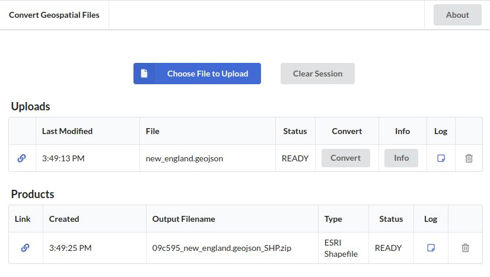

# GIS-Convert

https://convert-geo.com/

This is a thin user interface around the powerful ogrinfo and ogr2ogr commands.

Session data is tracked in browser localStorage. A unique and anonymous session ID will be created for you, and it will persist across browser sessions and tabs.

If you navigate away from the page and then return, your identity will be remembered and your files will still be available to you. All uploads and converted products expire 24 hours after creation, at which point they will be deleted from the server.

While I have no interest personally in the data that is uploaded, I can not guarantee privacy. Please don't upload any sensitive information.
